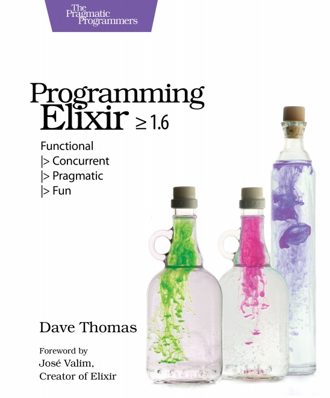

# Лабораторная работа №0

- Студент: `Кобелев Роман Павлович`
- Группа: `P3312`
- ИСУ: `368308`

---

## Язык программирования и инструментальные средства

| Язык программирования                  | `Elixir`               |
|:---------------------------------------|------------------------|
| Компилятор                             | `Mix`                  |
| Система сборки                         | `Mix`                  |
| Система автоматического форматирования | `Mix`                  |
| Lint tool                              | `Credo`                |
| Инструмент тестирования                | `ExUnit`               |

---

## Эссе 

Я выбрал функциональный язык `Elixir` по нескольким причинам.

Во-первых, `Elixir` работает поверх виртуальной машины `BEAM`, что говорит об высокой отказоучтойчивости и распределённой архитектуре. Меня заинтересовала возможность расширяемости приложения, а также работа с многопоточностью. Хочу сам попробовать написать такого рода приложение.

Во-вторых, сравнивая разные функциональные языки я заметил, что у этого языка понятный синтаксис. Мне открывается доступ к большому количеству библиотек `Erlang`, что также упрощает написание программы. У `Elixir` активное сообщество разработчиков, что поможет мне в изучении языка.

Также я хотел бы выбрать `Elixir` из-за широкого набора фреймворков (например `Phoenix`) и инструмента сборки `Mix`. С помощью `Mix` я смогу не только инициализировать и компилировать мои проекты, но ещё и форматировать.

В конце концов `Elixir` идеально подходит для разработки проектов для 4 лабораторной, которые я планирую со своей командой сделать. Мы сейчас рассматриваем либо CLI группового чата, где я буду писать серверную часть.

---

## Книга

[`Programming Elixir >= 1.6`](https://vk.com/doc273848965_477218994?hash=2V0uz2wwQ8XYVfGoy9e1Vda3jt6tDrWUowQ0cNh0gxD&dl=mkpVQ4FtSa6uqBXK20EZr40zm7q2Sc58nP54BdP47z4)

